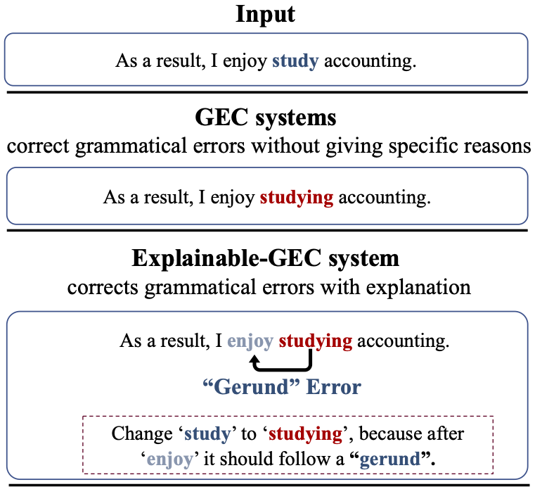
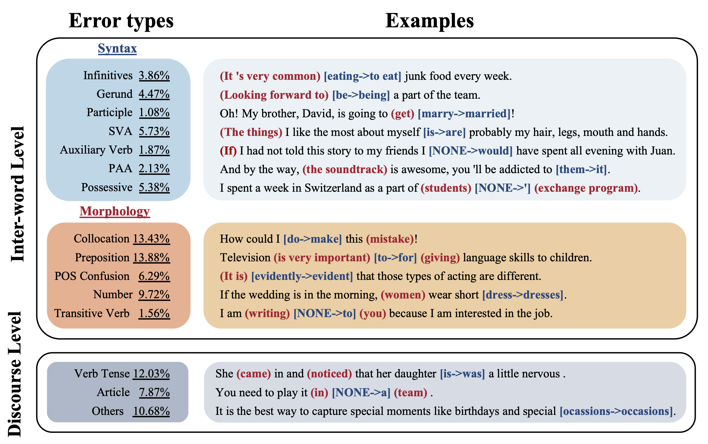

# Explainable Grammmar Error Correction
[Enhancing Grammatical Error Correction Systems with Explanations]() (ACL2023)
## 🚀Introduction
To help language learners understand why the Grammmar Error Correction system makes a certain correction, we present EXPECT, a large dataset with evidence words
and grammatical error types labeled. 



We also put forward several robust benchmarks for this task.

## 📄Examples
Examples of each error type and corresponding evidence words in EXPECT. 



## 📉Dataset Statistics
|  | Train | Dev | Test | Outputs |
|--------- | --- | --- | --- | --- |
| Number of sentences        | 15,187   | 2,413    | 2,416  | 1001 |
| Number of words            | 435,503  | 70,111  | 70,619 | 27,262 |
| Avg. w.p.s                 | 28.68    | 29.06   | 29.23  | 27.23  |
| With evidence rate         | 74.15    | 59.10   | 59.77  | 72.73|
| Total evidence words       | 29,187   | 4,280   | 4,340  | 1736 |
| Avg. evidence w.p.s        | 2.59     | 3.00    | 3.01   | 2.38|

## 📝 Dataset Description
`data/json/train.json` is the training set. `data/json/dev.json` and `data/json/test.json` are the dev set and test set, which are splited from the dev set of W&I+LOCNESS. 
The format of the samples is shown below:
```shell
{
"target": ["It", "has", "a", "high", "-", "density", "population", "because", "of", "its", "small", "territory", "."], 
"source": ["It", "has", "a", "high", "-", "density", "population", "because", "[NONE]", "its", "small", "territory", "."], 
"correction_index": [8, 22], 
"evidence_index": [7, 9, 10, 11, 21, 23, 24, 25], 
"error_type": "Preposition", 
"predicted_parsing_order": {"1": 3, "5": 2, "7": 2, "8": 1, "9": 3, "10": 2, "15": 3, "19": 2, "21": 2, "22": 1, "23": 3, "24": 2}, 
"origin": "A"
}
```
1. `"target"` is the corrected sentence, with the corrected words indexed with `"correction_index"`.
2. `"source"` is the erroneous sentence, with the erroneous words also indexed with `"correction_index"`.
3. `"correction_index"` is the index of corrected and erroneous words, where the target and source sentences are concatenated with a separation token in between.
4. `"evidence_index"` is the index of evidence words for both the target and source sentences, where the target and source sentences are concatenated with a separation token in between.
5. `"error_type"` is the class of the error type.
6. `"predicted_parsing_order"` represents first-order dependent words (Number 2) and second-order dependent words (Number 3) in the dependency parse tree. Number 1 represents the position of the corrections.
7. `"origin"` is the learner's CEFR proficiency, which corresponds to W&I+LOCNESS.

## 📥 How to Use the Data

We provide a script for processing the raw data into NER input format. Specify `data_file` and `save_file` in `read_jsonl.py `.

```shell
python read_jsonl.py --data_file data/json/test.json --save_file data/ner/train.pkl
```

And use the processed data as the input of the model.


## 📜 License

This dataset is released under the [MIT License](LICENSE).

## 📚 Citation

If you use this dataset in your research, please cite it as follows:

```bibtex
@inproceedings{fei-cui-2023-enhancing,
title = "Enhancing Grammatical Error Correction Systems with Explanations",
author = “Fei, Yuejiao  and
   Cui, Leyang and
   Yang, Sen and
   Lam, Wai and
   Lan, Zhenzhong and
   Shi, Shuming”,
month = jul,
year = "2023”,
address = “Toronto, Canada”,
publisher = "Association for Computational Linguistics",
}
